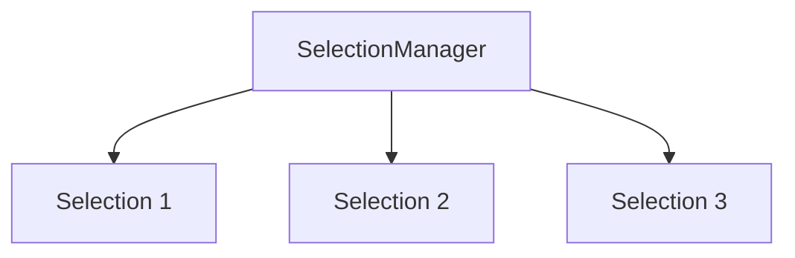

# Cursor and Selection Range Architecture

## 1. Design Philosophy
A cursor in our editor is modeled as a **Selection** range, which consist of:
- `head`: The absolute character offset of the cursor head (where text insertions/deletions occur).
- `tail`: The absolute character offset of the selection anchor.
- `goal_column`: The visual column we try to maintain when moving vertically (up/down).

When `head == tail`, the selection is empty (it is a standard cursor).
When `head != tail`, the selection contains all characters in the half-open interval `[min(head, tail), max(head, tail))`.

---

## 2. Selection Manager and Multiple Cursors
To support future managed multiple cursors, we introduce the `SelectionManager` struct, which maintains an array of disjoint, non-overlapping `Selection` objects:

### 2.1. Selection Normalization
Whenever a selection is added, moved, or resized, the `SelectionManager` automatically **normalizes** the selections:
1. Sorts all selections by their starting offset.
2. Merges overlapping or adjacent selections into a single selection.
3. Ensures that we always have a clean, disjoint list of active selections.

---

## 3. Editor Rendering Integration
During viewport rendering, for each character position, we compute its absolute offset:
$$\text{offset} = \text{line\_start\_offset} + \text{raw\_col}$$

If any active selection contains this offset, we wrap the character in an ANSI highlight escape sequence:
- Selection background: `\x1b[48;5;239m` (nice dark gray).
- Normal reset: `\x1b[m`.

This handles rendering character-based highlights, tab expansions, and line-ending newlines.
