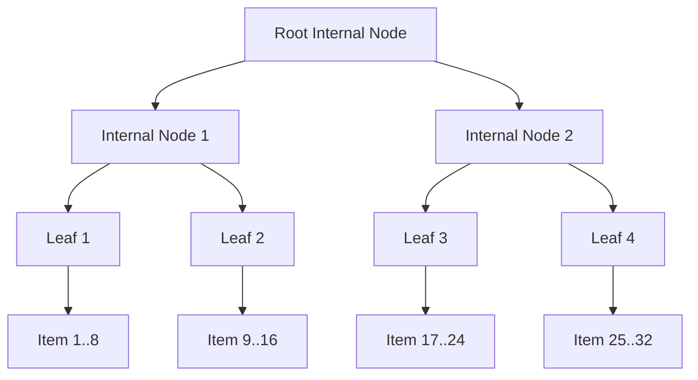

# SumTree and Rope Initial Load Optimization Plan

## 1. Current Bottleneck
When loading a large file in `examples/editor.zig`, the editor currently:
1. Reads the entire file content into a memory buffer.
2. Calls `rope.insert(0, content)`.
3. `Rope.replace` chunks the string into 128-byte `RopeChunk` payloads.
4. It iterates and inserts these chunks **one-by-one** using the tree cursor, calling `left_slice.push(chunk)`.

### Performance Cost:
Inserting items one-by-one into a B+ tree (or `SumTree`) has a time complexity of $\mathcal{O}(M \log N)$, where $M$ is the number of chunks and $N$ is the number of items. Each sequential push requires:
- Searching/seeking to the end of the tree.
- Allocating new leaf and internal nodes.
- Rebalancing nodes, copying entries, and updating reference counts on parent nodes.

For a 10MB file, this requires pushing $\sim 80,000$ chunks, resulting in significant heap allocation overhead, node copying, and CPU usage, causing the file load to take hundreds of milliseconds.

---

## 2. Solution: Bottom-Up Bulk Loading ($\mathcal{O}(N)$)

Instead of incremental insertions, we can build the `SumTree` in linear time $\mathcal{O}(N)$ using a **bottom-up bulk loader**, similar to the `from_iter` implementation in Zed's `sum_tree.rs`.

### 2.1. Bottom-Up Building Algorithm
Given a slice of items:
1. **Leaf Level**: Group the items into chunks of `MAX_CHILDREN` (8). Create a leaf node for each chunk, populate its items, calculate its summary, and collect the leaf nodes.
2. **Internal Levels**: Group the leaf nodes into chunks of `MAX_CHILDREN` (8). Create an internal parent node for each chunk, pointing to the children, calculate the parent summary, and collect the parents.
3. **Repeat**: Repeat the parent grouping level-by-level until only a single root node remains.



### 2.2. Complexity and Benefits
- **Time Complexity**: $\mathcal{O}(N)$ operations and memory allocations.
- **Space Density**: Leaves and internal nodes are perfectly filled to capacity (`MAX_CHILDREN`), maximizing search cache locality and minimizing the total number of allocated nodes.
- **Keystroke Performance**: Zero rebalancing operations occur during initial loading.

---

## 3. Implementation Plan

### Step 1: Add `initFromSlice` to `SumTree.zig`
Add a generic constructor `initFromSlice(allocator, items, cx)` that builds a `SumTree` in-place bottom-up:
```zig
pub fn initFromSlice(allocator: Allocator, items: []const Item, cx: Summary.Context) !*SumTree(Item)
```

### Step 2: Add `initFromString` to `Rope.zig`
Implement a bulk-loading string constructor in `Rope.zig` that chunks the string and bulk-loads the `SumTree`:
```zig
pub fn initFromString(allocator: Allocator, content: []const u8) !*Self
```

### Step 3: Integrate in `editor.zig`
Modify `examples/editor.zig` to use `Rope.initFromString` when loading a file:
```zig
    var rope: *Rope = undefined;
    if (file_content) |content| {
        rope = try Rope.initFromString(allocator, content);
    } else {
        rope = try Rope.init(allocator);
    }
    defer rope.deinit();
```

---

## 4. Keystroke Editing Optimization Plan

### 4.1. Current Keystroke Bottleneck
Whenever a key is pressed (a character typed, backspace, or delete), `examples/editor.zig` calls `ed_ctx.onEdit()`. This completely clears and rebuilds the `WrapMap` tree from scratch by pushing estimates for all $N$ lines, which takes $\mathcal{O}(N)$ time.
While this was acceptable for small files, for a 100,000-line file it introduces a 2ms–5ms lag on every keystroke, which is noticeable during fast typing.

### 4.2. Incremental Line Wrapping Updates ($\mathcal{O}(\log N)$)
Since typing a character or backspacing within a line only alters the text of the *current line*, the wrapping of all other lines remains identical.
Instead of rebuilding the entire tree, we can update the modified line in-place in $\mathcal{O}(\log N)$ time:
1. **`updateLine(row, rope)` method**:
   - Fetches the current text for the modified line.
   - Computes its precise wrapping layout.
   - Replaces the line entry at index `row` in the `WrapMap` tree.
   - Marks the line as wrapped in the dynamic bitset.
2. **Editor Context Integration**:
   - Add `onLineEdit(row)` to `EditorContext`.
   - Use `onLineEdit(row)` for character input and single-line backspaces/deletes.
   - Fall back to the full `onEdit()` only when line counts change (e.g. inserting a newline or deleting a newline to merge lines).
```
