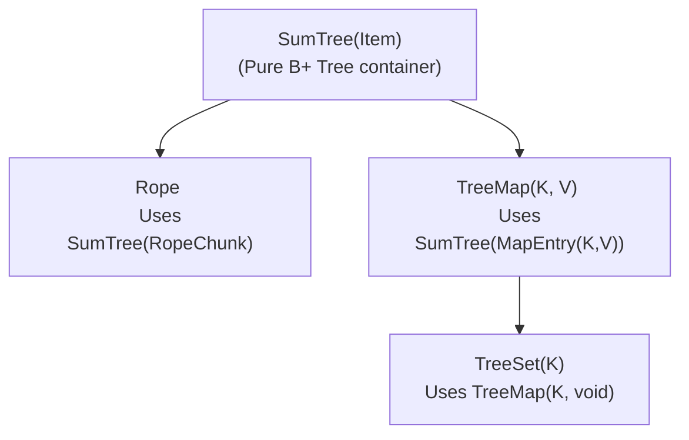
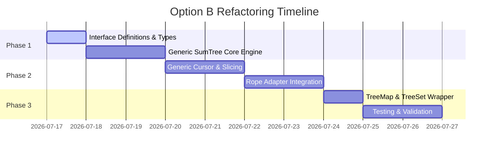
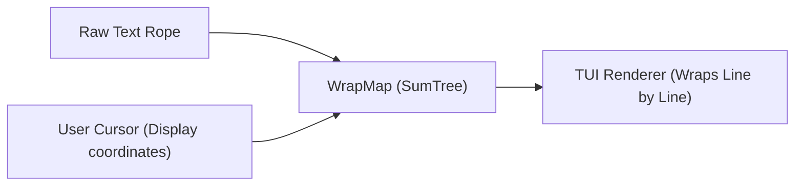

# Design & Implementation Plan: Option B (Generic SumTree)

This document details the design, type architecture, and step-by-step implementation plan to refactor the Zig `sum_tree` library into a **fully generic, type-agnostic B+ Tree container**. Using this generic tree, we will then build both the high-level `Rope` text engine and the `TreeMap`/`TreeSet` collections.

---

## 1. Architectural Philosophy of Option B

In the current codebase, `SumTree.zig` is coupled to `Rope` text concerns. It assumes that text chunks are stored in a single flat, append-only `ArrayList(u8)`, and that leaves store offsets (`start` index and `length`) into that array.

By refactoring `SumTree` to be generic (similar to Zed's Rust implementation), we transition to a design where:
1. `SumTree(comptime Item: type)` is a pure data structure that stores arbitrary `Item` elements directly in its leaf nodes.
2. Memory allocation is decentralized: items are owned by the leaf nodes. When a tree node's reference count drops to 0, its items are destroyed immediately.
3. The Rope is re-implemented by defining a `RopeChunk` struct (holding a stack-allocated string fragment, e.g. up to 128 bytes) as the `Item` type.
4. `TreeMap<K, V>` is implemented by defining a `MapEntry(K, V)` struct as the `Item` type.



> [!NOTE]
> **Automatic Memory Compaction:** Because leaf nodes store text fragments directly rather than referencing offsets in a global append-only buffer, dead text is automatically reclaimed when nodes are freed. This resolves the append-only memory leak of the current Rope design without requiring a separate garbage collector!

---

## 2. Duck-Typed Generic Interfaces in Zig

To achieve compile-time generic behavior without the overhead of interfaces or virtual tables, we will use Zig's compile-time duck typing. The generic `SumTree(Item)` will require the `Item` type to satisfy the following static contracts:

```zig
// -------------------------------------------------------------
// 1. The Item Interface
// -------------------------------------------------------------
// Any type 'Item' passed to SumTree(Item) must define:
//   - Item.Summary: A type representing the subtree summary.
//   - Item.summary(self: Item, cx: Item.Summary.Context) Item.Summary
// 
// -------------------------------------------------------------
// 2. The Summary Interface
// -------------------------------------------------------------
// The 'Item.Summary' type must define:
//   - Summary.Context: A type representing external context needed 
//     during aggregation (can be 'void' if no context is needed).
//   - Summary.zero(cx: Context) Summary
//   - Summary.add(self: *Summary, other: Summary, cx: Context) void
// 
// -------------------------------------------------------------
// 3. The Dimension Interface
// -------------------------------------------------------------
// A 'Dimension' represents a metric used to accumulate positions 
// along the tree (e.g. char offset, line number, key dimension).
// It must define:
//   - Dimension.zero(cx: Summary.Context) Dimension
//   - Dimension.addSummary(self: *Dimension, summary: Summary, cx: Summary.Context) void
// 
// -------------------------------------------------------------
// 4. The SeekTarget Interface
// -------------------------------------------------------------
// A 'SeekTarget' is used to query the cursor position.
// It must define:
//   - SeekTarget.cmp(self: SeekTarget, cursor_pos: Dimension, cx: Summary.Context) std.math.Order
```

---

## 3. Designing Generic Types & Layouts

### 3.1. Reference-Counted Node Layout

```zig
pub fn Node(comptime Item: type) type {
    const Summary = Item.Summary;
    return struct {
        rc: usize = 1,
        height: usize = 0,
        summary: Summary,
        children: union(enum) {
            internal: BoundedArray(*Node(Item), MAX_CHILDREN),
            leaf: BoundedArray(Item, MAX_CHILDREN),
        },
        
        // Memory management
        pub fn ref(self: *Node(Item)) *Node(Item) {
            self.rc += 1;
            return self;
        }

        pub fn deref(self: *Node(Item), allocator: Allocator) void {
            self.rc -= 1;
            if (self.rc == 0) {
                switch (self.children) {
                    .internal => |internal| {
                        for (internal.slice()) |child| {
                            child.deref(allocator);
                        }
                    },
                    .leaf => {}, // Leaf items are stack-allocated inside the union
                }
                allocator.destroy(self);
            }
        }
    };
}
```

### 3.2. Generic `SumTree(Item)` Struct

```zig
pub fn SumTree(comptime Item: type) type {
    const Summary = Item.Summary;
    return struct {
        const Self = @This();
        
        allocator: Allocator,
        root: *Node(Item),
        cx: Summary.Context,

        pub fn init(allocator: Allocator, cx: Summary.Context) !*Self {
            const tree = try allocator.create(Self);
            const root = try allocator.create(Node(Item));
            root.* = .{
                .rc = 1,
                .height = 0,
                .summary = Summary.zero(cx),
                .children = .{ .leaf = .{} },
            };
            tree.* = .{
                .allocator = allocator,
                .root = root,
                .cx = cx,
            };
            return tree;
        }

        // Functional COW clone, joinNodes, append, and slice operations...
    };
}
```

### 3.3. Generic `Cursor(Item, Dimension)`

The `Cursor` keeps track of its location using a stack of node pointers and index paths, maintaining a running position of type `Dimension`.

```zig
pub fn Cursor(comptime Item: type, comptime Dimension: type) type {
    const Summary = Item.Summary;
    return struct {
        const Self = @This();
        
        tree: *SumTree(Item),
        stack: BoundedArray(StackEntry, 16) = .{},
        position: Dimension,

        const StackEntry = struct {
            node: *Node(Item),
            index: usize,
            offset: Dimension,
        };

        pub fn init(tree: *SumTree(Item)) Self {
            var c = Self{
                .tree = tree,
                .position = Dimension.zero(tree.cx),
            };
            c.reset();
            return c;
        }

        pub fn seek(self: *Self, target: anytype) void {
            // target must support: cmp(self, position, cx)
            // walks the tree, comparing target against current running position
        }
    };
}
```

---

## 4. Re-Implementing Rope on `SumTree(RopeChunk)`

### 4.1. The `RopeChunk` and `RopeSummary`

To store text, we bundle small string slices inside leaf nodes:

```zig
pub const RopeChunk = struct {
    // Stores inline bytes up to 128 characters to prevent allocations
    text: BoundedArray(u8, 128) = .{},

    pub const Summary = struct {
        pub const Context = void;
        char_len: usize = 0,
        line_len: usize = 0,
        utf16_len: usize = 0,

        pub fn zero(cx: Context) Summary { _ = cx; return .{}; }
        pub fn add(self: *Summary, other: Summary, cx: Context) void {
            _ = cx;
            self.char_len += other.char_len;
            self.line_len += other.line_len;
            self.utf16_len += other.utf16_len;
        }
    };

    pub fn summary(self: RopeChunk, cx: Summary.Context) Summary {
        _ = cx;
        const text_slice = self.text.slice();
        var lines: usize = 0;
        for (text_slice) |b| {
            if (b == '\n') lines += 1;
        }
        
        // Count UTF-16 code units (surrogate pairs)
        var utf16: usize = 0;
        var i: usize = 0;
        while (i < text_slice.len) {
            const cp_len = std.unicode.utf8ByteSequenceLength(text_slice[i]) catch 1;
            utf16 += if (cp_len == 4) @as(usize, 2) else 1;
            i += cp_len;
        }

        return .{
            .char_len = text_slice.len,
            .line_len = lines,
            .utf16_len = utf16,
        };
    }
};
```

---

## 5. Implementing `TreeMap` on `SumTree(MapEntry)`

### 5.1. The `MapEntry` and `MapKeySummary`

To build the ordered key-value map, we configure `add` to implement the "last child's key wins" rule:

```zig
pub fn MapEntry(comptime K: type, comptime V: type) type {
    return struct {
        key: K,
        value: V,

        pub const Summary = struct {
            pub const Context = void;
            max_key: ?K = null,

            pub fn zero(cx: Context) Summary { _ = cx; return .{}; }
            
            // "Last Item Wins" aggregation:
            pub fn add(self: *Summary, other: Summary, cx: Context) void {
                _ = cx;
                if (other.max_key) |k| {
                    self.max_key = k;
                }
            }
        };

        pub fn summary(self: @This(), cx: Summary.Context) Summary {
            _ = cx;
            return .{ .max_key = self.key };
        }
    };
}
```

### 5.2. Map SeekTarget & Dimension

```zig
pub fn MapKeyDimension(comptime K: type) type {
    return struct {
        max_key: ?K = null,
        
        pub fn zero(cx: void) @This() { _ = cx; return .{}; }
        pub fn addSummary(self: *Self, s: anytype, cx: void) void {
            _ = cx;
            if (s.max_key) |k| {
                self.max_key = k;
            }
        }
    };
}

pub fn MapSeekTarget(comptime K: type) type {
    return struct {
        target: K,
        comparator: *const fn(K, K) std.math.Order,

        pub fn cmp(self: @This(), pos: MapKeyDimension(K), cx: void) std.math.Order {
            _ = cx;
            if (pos.max_key) |key| {
                return self.comparator(self.target, key);
            }
            return .greater; // Empty positions are less than any target key
        }
    };
}
```

---

## 6. Step-by-Step Refactoring Plan



### Phase 1: Core Engine Refactoring
1. **Define static duck-typed contracts:** Outline all expected method signatures in `SumTree.zig` documentation comments and add compile-time checks (`comptime { ... }` or `@compileError`) checking that `Item` behaves as expected.
2. **Rewrite Node Layout:** Change the `Node` union to store stack-allocated `BoundedArray(Item, MAX_CHILDREN)` payload in leaves.
3. **Rewrite COW & Joining:** Update `toMut`, `joinNodes`, and `append` to work with generic items.

### Phase 2: Querying & Adaptation
4. **Implement Generic Cursor:** Refactor `Cursor` to traverse the generic tree using a stack, generic `Dimension` running aggregations, and `SeekTarget` query dispatching.
5. **Port Rope to generic tree:**
   - Define `RopeChunk` and `RopeSummary`.
   - Update `Rope.zig` to wrap `SumTree(RopeChunk)`.
   - Implement split/join mechanics for string inserts and deletes at the `RopeChunk` boundaries.

### Phase 3: Collections & Testing
6. **Implement `TreeMap`:** Write `src/TreeMap.zig` wrapping `SumTree(MapEntry(K, V))`.
7. **Implement `TreeSet`:** Write `src/TreeSet.zig` wrapping `TreeMap(K, void)`.
8. **Fix Tests:** Update the existing tests in `src/tests.zig` to use the new generic structures, and add dedicated tests for both `TreeMap` and `TreeSet`.

---

## 7. Extending to a WrapMap (Zed-Inspired Display Mapping)

### 7.1. Can `TreeMap` be the Basis of a `WrapMap`?

In Zed's editor architecture, the raw buffer (`MultiBuffer`) is mapped to a display space via a sequence of translation maps called the **DisplayMap Pipeline**. The stages include:
- `AnchorMap` -> `FoldMap` (folds regions of code) -> `TabMap` (expands tab characters to spaces) -> `WrapMap` (soft wraps long lines to fit the window width).

To implement a similar `WrapMap` in our Zig library:
- **A standard `TreeMap` is NOT the optimal basis:** A `TreeMap<K, V>` maps static, sorted keys to values. Because soft wrapping introduces virtual display rows, editing text on line 5 shifts the screen coordinates (display rows) of all subsequent lines. Updating absolute keys in a `TreeMap` would require $O(N)$ key shifts.
- **`SumTree` is the ideal container:** Like Zed's implementation, a `SumTree(Item)` is perfect for a `WrapMap` because it aggregates *relative summaries* (e.g., display rows, buffer characters). Inserting, deleting, or re-wrapping a single line only requires updating a single leaf, taking $O(\log N)$ time, and the prefix sums (absolute coordinate offsets) are automatically accumulated by the tree hierarchy.

---

### 7.2. TUI-Specific WrapMap Design

Unlike graphical editors (like GPUI/Zed) which require asynchronous pixel-width text measurements, a **TUI (Terminal User Interface)** environment uses monospace characters. This allows us to make the `WrapMap` completely synchronous, fast, and deterministic.

#### 1. The `LineWrapEntry` Item
We can store the wrapping details of each buffer line as an item in `SumTree(LineWrapEntry)`:

```zig
pub const LineWrapEntry = struct {
    raw_chars: usize,  // Count of raw buffer characters in this line (including '\n')
    display_rows: usize, // Number of screen rows this line takes at the current wrap width

    pub const Summary = struct {
        pub const Context = void;
        buffer_lines: usize = 0,
        raw_chars: usize = 0,
        display_rows: usize = 0,

        pub fn zero(cx: Context) Summary {
            _ = cx;
            return .{};
        }

        pub fn add(self: *Summary, other: Summary, cx: Context) void {
            _ = cx;
            self.buffer_lines += other.buffer_lines;
            self.raw_chars += other.raw_chars;
            self.display_rows += other.display_rows;
        }
    };

    pub fn summary(self: LineWrapEntry, cx: Summary.Context) Summary {
        _ = cx;
        return .{
            .buffer_lines = 1,
            .raw_chars = self.raw_chars,
            .display_rows = self.display_rows,
        };
    }
};
```

#### 2. Coordinate Types
```zig
pub const BufferPoint = struct {
    row: usize, // 0-indexed buffer line
    col: usize, // 0-indexed byte/char offset within line
};

pub const DisplayPoint = struct {
    row: usize, // 0-indexed terminal screen line
    col: usize, // 0-indexed screen column
};
```

---

### 7.3. Coordinate Translation Flow

By using a `Cursor` on `SumTree(LineWrapEntry)`, we can translate coordinates in $O(\log N)$ time:

#### 1. `bufferToDisplay(self: *WrapMap, pt: BufferPoint) DisplayPoint`
1. Seek the cursor to the seek target `pt.row` using `buffer_lines` as the seek dimension.
2. The cursor's accumulated display rows tell us the screen row where the buffer line starts.
3. Within the target line, calculate how many screen rows are spanned by `pt.col` using the wrap width $W$:
   - `line_row_offset = pt.col / W`
   - `line_col_offset = pt.col % W`
4. Return `DisplayPoint{ .row = accumulated_display_rows + line_row_offset, .col = line_col_offset }`.

#### 2. `displayToBuffer(self: *WrapMap, pt: DisplayPoint) BufferPoint`
1. Seek the cursor to `pt.row` using `display_rows` as the seek dimension.
2. The cursor's accumulated `buffer_lines` gives us the raw buffer row `pt.row`.
3. Within that line, the vertical offset on screen is `line_row_offset = pt.row - accumulated_display_rows`.
4. Calculate the character column: `char_col = line_row_offset * W + pt.col`.
5. Return `BufferPoint{ .row = accumulated_buffer_lines, .col = @min(char_col, raw_line_len) }`.

---

### 7.4. Implementation & Integration Plan in `examples/editor.zig`

To integrate this TUI-aware soft wrapping into our editor, we will follow these steps:



#### Step 1: WrapMap Module
Create `src/WrapMap.zig` wrapping `SumTree(LineWrapEntry)`:
- Initialize the tree by reading lines from the `Rope` and computing their `display_rows` based on the wrap width $W$.
- Expose `bufferToDisplay` and `displayToBuffer` translation helpers.
- Expose a `replace(line_idx: usize, old_count: usize, new_lines: []const LineWrapEntry)` method to incrementally update the wrap metrics in $O(\log N)$ when edits occur.

#### Step 2: Update Rendering in `examples/editor.zig`
Modify the draw loop inside [examples/editor.zig](file:///home/iceman/Developer/zig/sum_tree/examples/editor.zig):
1. Instead of rendering raw lines from the rope, query `WrapMap` to find which raw characters span each visible screen row.
2. Use `displayToBuffer` to translate the visible screen range `[top_scroll_row, top_scroll_row + height]` to the corresponding rope text ranges.
3. Draw exactly $W$ characters per screen row, adding a visual indicator (like a soft-wrapped arrow `↵` or subtle styling) at the wrap point.

#### Step 3: Handle Window Resizing
When the terminal window size changes:
1. Capture the new width $W$.
2. Re-initialize/re-populate the `WrapMap` with the new width $W$. Since character wrapping is O(N), this takes < 1ms even for large documents.
3. Re-render the editor viewport.

#### Step 4: Adjust Navigation (Up / Down Keys)
- Moving the cursor **Up / Down** must navigate line-by-line in **Display Space** (so pressing Down moves to the next wrapped screen line segment, not the next physical buffer line).
- Translate the final display cursor coordinates back to `BufferPoint` offsets to perform edits on the underlying `Rope`.

