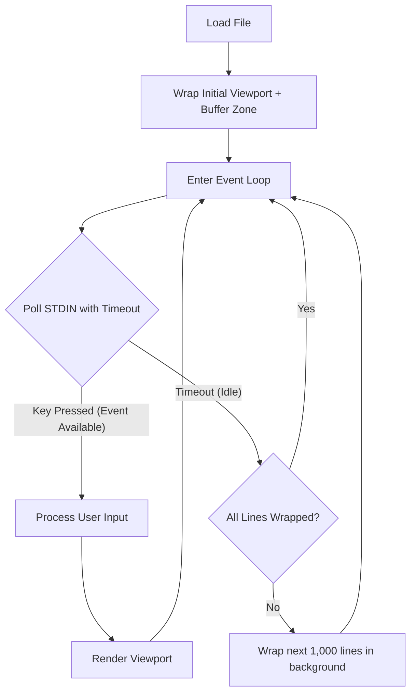

# WrapMap Performance Optimization: Lazy & Idle Wrapping

## 1. Problem Statement
Currently, the `WrapMap` calculates soft-wrap configurations for the entire file synchronously:
- **On Initial Load**: The entire file is scanned, tab-expanded, and wrapped line-by-line.
- **On Terminal Resize**: The entire document is re-wrapped with the new screen width.
- **On Edits**: Any text insertion or deletion triggers a full re-wrap of the document.

While monospace wrapping is extremely fast ($\mathcal{O}(1)$ per line), doing it for the entire file synchronously runs in $\mathcal{O}(N)$ where $N$ is the number of lines. For small to medium files (< 5,000 lines), this is imperceptible (< 1ms). However, for large files (e.g., $N = 100,000$), a full re-wrap takes $\sim 50\text{--}150\text{ms}$ on the main event loop, causing noticeable input lag on every keystroke.

---

## 2. Proposed Architecture: Lazy & Idle Wrapping

To make the editor feel instant even on massive files, we can transition from **eager eager-wrapping** to a **lazy + idle background wrapping** scheme.



### 2.1. Lazy Viewport Wrapping
The editor only renders the viewport (typically 24–50 lines). To render the screen, we only need to know the wrap positions up to the last visible display row.
- **`wrapped_up_to` Pointer**: We maintain a high-water mark `wrapped_up_to` (the line index up to which layout wrapping has been computed).
- **On-Demand Wrap**: If the viewport scrolls or the cursor moves to a line index $L > \text{wrapped\_up\_to}$, we synchronously wrap the document from `wrapped_up_to` to $L + \text{buffer\_zone}$ (e.g. 100 lines extra) on the fly. This ensures the viewport is always correctly rendered without wrapping the entire file.

### 2.2. Idle Wrap Processing
When the editor is waiting for user input, it spends most of its time blocked. We can utilize this idle time to run background wrapping calculations:
- **Non-blocking Input Polling**: Replace blocking input reads with a polled read. In a TUI, we can use `std.posix.poll` on `STDIN_FILENO` with a small timeout (e.g., 50ms).
- **Chunked Wrapping**: If `poll` times out (no key pressed), the editor performs a chunk of wrapping work (e.g., wrapping 1,000 lines) and advances `wrapped_up_to`.
- **Interruptible Work**: If the user presses a key, `poll` returns immediately. The background wrapping is paused, and the editor responds to the user's keystroke with zero latency.

---

## 3. Implementation Details

### 3.1. Non-blocking Input in `Tui.zig`
We can extend `Tui.readKey` to support non-blocking polling or a timeout:

```zig
pub fn readKeyTimeout(self: *Tui, timeout_ms: i32) !?Key {
    var fds = [1]std.posix.pollfd{.{
        .fd = std.posix.STDIN_FILENO,
        .events = std.posix.POLL.IN,
        .revents = 0,
    }};
    
    const count = try std.posix.poll(&fds, timeout_ms);
    if (count == 0) {
        return null; // Timeout (idle opportunity!)
    }
    
    // Perform standard read logic ...
}
```

### 3.2. Incremental `WrapMap` Calculations
Instead of starting with a fully populated `SumTree`, `WrapMap` can start with placeholder entries or simply grow on-demand.
- **Growing the Tree**:
  - We can initially initialize `WrapMap` with only the first $K$ wrapped lines.
  - As more lines are wrapped (either during scrolling or idle time), we `push` new `LineWrapEntry` nodes onto the tree.
  - Since `SumTree` supports fast append/push operations, growing the tree takes $\mathcal{O}(\log N)$ per addition.
- **Handling Resizes**:
  - On resize, we reset `wrapped_up_to = 0` and clear the `WrapMap`.
  - We immediately wrap the visible lines (e.g. first 50 lines) to render the screen instantly.
  - The background idle processing will then lazily rebuild the rest of the wrap map.

---

## 4. Performance & UX Impact
- ** Keystroke Latency**: Keystroke latency drops from $\mathcal{O}(N)$ to $\mathcal{O}(1)$ or $\mathcal{O}(\log N)$ (since edits only re-wrap the modified line and update the tree structure in log time).
- **File Load Time**: Large files open instantly since we don't block the UI thread to wrap the whole file before rendering.
- **Smooth Scrolling**: Scrolling remains fluid because wrapping a few hundred extra lines on-demand is extremely fast (< 1ms).
- **Zero Threading Overhead**: Because this uses single-threaded polling, we avoid complex thread synchronization, locking, and race conditions, maintaining the codebase's simplicity and robustness.
